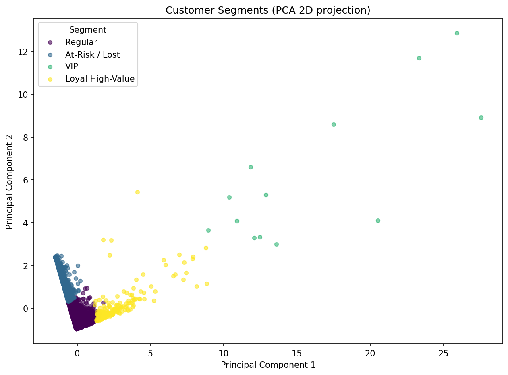

# Customer Segmentation with RFM, PCA & K-Means

Segmenting ~4,300 customers of a UK online retailer into actionable groups using **RFM analysis**, **PCA**, and **k-means clustering** in Python.

> **Key finding:** Just **5% of customers drive ~48% of total revenue.** Identifying and protecting these high-value segments is the project's core business insight.

## Overview
This project takes a year of real transaction data (~540,000 records) and turns it into a customer-level segmentation a business can act on — distinguishing loyal high-value customers from at-risk and lapsed ones, so marketing and retention efforts can be targeted rather than one-size-fits-all.

## Dataset
[UCI Online Retail dataset](https://archive.ics.uci.edu/dataset/352/online+retail) — real transactions from a UK-based online gift retailer, 2010–2011 (~541,000 rows).

## Method
1. **Cleaning** — removed transactions with no customer ID, cancelled orders, and invalid (zero/negative) quantities and prices, reducing ~541k raw rows to ~398k valid sales.
2. **Feature engineering (RFM)** — collapsed transactions to one row per customer with three features: **Recency** (days since last purchase), **Frequency** (number of orders), and **Monetary** (total spend).
3. **Scaling** — standardised the features so each contributes fairly to distance-based clustering.
4. **PCA** — reduced the three features to two principal components (retaining ~86% of variance) for visualisation.
5. **K-means** — used the elbow method to select k=4, then clustered customers into four segments.
6. **Profiling** — characterised each segment and quantified its share of revenue.

## Segments Found
| Segment | Profile | Size |
|---|---|---|
| **VIP** | Bought very recently, extremely frequent, highest spend | ~13 customers |
| **Loyal High-Value** | Recent, frequent, high spend | ~200 customers |
| **Regular** | Moderately active, average spend | ~3,000 customers |
| **At-Risk / Lost** | Haven't purchased in months, low spend | ~1,000 customers |

## Tools
Python, pandas, NumPy, scikit-learn (StandardScaler, PCA, KMeans), matplotlib, Jupyter.

## Files
- `customer_segmentation_project.ipynb` — full analysis notebook
- `customer_segments.csv` — final customer-level results with segment labels
